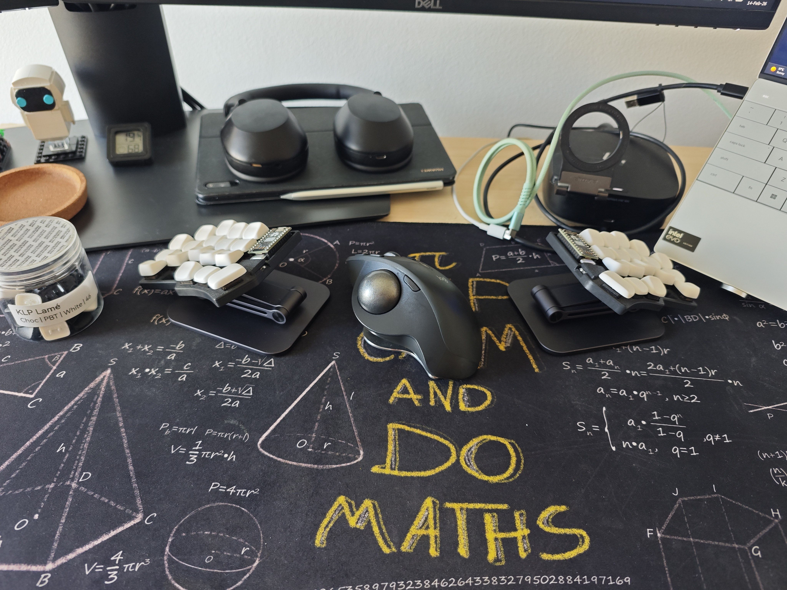

# ⌨️ Temper ZMK: The "Precision Gear" Layout


A high-performance **36-key split layout** for the [Temper keyboard](https://github.com/clyteduo/temper). This configuration merges **Colemak-DH** efficiency with specialized **Greek-bilingual** support and a unique "Manual Gearbox" system for mouse control.

---

## 📑 Table of Contents
1. [Base Layout & Philosophy](#base-layout--philosophy)
2. [Thumb Clusters & Sticky Logic](#thumb-clusters--sticky-logic)
3. [The Gearbox (Mouse & Scroll)](#the-gearbox-mouse--scroll)
4. [Combos & Shortcut Architecture](#combos--shortcut-architecture)
5. [Layer Reference](#layer-reference)
6. [Photos](#photos)

---

## Base Layout & Philosophy
The foundation is **Colemak-DH**, modified for high-speed bilingual typing.

* **Greek Optimization**: The bottom-row pinky key is mapped to `;`. In Greek software layouts, this provides the **accent (΄)** for vowels (ά, έ, ί, ό, ή, ύ, ώ).
* **Shifted Punctuation**: The `'` key has been moved to the top-row pinky to accommodate the Greek accent key.
* **No Home-Row Mods (HRM)**: To eliminate the latency and "misfire" risks inherent in HRM, this layout relies on **Sticky Keys** and **Combos**. 
* **Seamless Switching**: This architecture allows for raw typing speeds and seamless switching between Greek and English without accidental modifier activations.

---

## Thumb Clusters & Sticky Logic

### The `sk_mo` Architecture
The left outer thumb utilizes a sophisticated `sk_mo` (Sticky Key Momentary) behavior. This allows the thumb to act as a **One-Shot Shift** for quick capitalization on tap, while doubling as the **Numbers Layer** trigger on hold.

In behaviors section:
```c
sk_mo: sticky_key_momentary {
    compatible = "zmk,behavior-hold-tap";
    #binding-cells = <2>;
    flavor = "tap-preferred";
    tapping-term-ms = <200>;
    bindings = <&mo>, <&sk>;
};
```
### Thumb Mappings
| Position | Left Hand (Tap/Hold) | Right Hand (Tap/Hold) |
| :--- | :--- | :--- |
| **Inner** (Tucked) | `Escape` / **BT (6)** | `Delete` / **Fun (5)** |
| **Neutral** (Home) | `Space` / **Nav (1)** | `Backspace` / **Mouse (4)** |
| **Outer** (Wide) | `Sticky Shift` / **Num (2)** | `Enter` / **Raise (3)** |

---

## ⚙️ The Gearbox: Dynamic Movement & Scrolling
This layout utilizes ZMK's input listener system to create a "Manual Transmission" for your pointer. While holding the **Mouse Layer (4)** with your right thumb, use your left-hand triggers to scale sensitivity on the fly.

| Gear | Trigger (Hold) | Scaling Ratio | Use Case |
| :--- | :--- | :--- | :--- |
| **1st** | **Nav (1)** | 🟢 **1:3 (33%)** | **High Precision**: Pixel-perfect UI design or fine scrolling. |
| **2nd** | **Num (2)** | 🟡 **1:2 (50%)** | **Medium Precision**: General navigation and spreadsheet work. |
| **3rd** | **Default (4)** | ⚪ **1:1 (100%)** | **Drive**: Standard desktop navigation. |
| **4th** | **Raise (3)** | 🔴 **3:1 (300%)** | **Turbo**: Rapid travel across multi-monitor setups. |

### Scaling Logic Example

Above behaviors section:
```c
&msc_input_listener {
    // Layer 1 (NAV) -> Slow: 1/3 speed
    scrl_slow { layers = <1>; input-processors = <&zip_scroll_scaler 1 3>; };
    
    // Layer 2 (NUM) -> Normal/Mid: 1/2 speed
    scrl_norm { layers = <2>; input-processors = <&zip_scroll_scaler 1 2>; };
    
    // Layer 3 (RSE) -> Fast: 3x speed
    scrl_fast { layers = <3>; input-processors = <&zip_scroll_scaler 3 1>; };
};

&mmv_input_listener {
    precisionnav { layers = <1>; input-processors = <&zip_xy_scaler 1 3>; };
    precisionnum { layers = <2>; input-processors = <&zip_xy_scaler 1 2>; };
    fastsym      { layers = <3>; input-processors = <&zip_xy_scaler 3 1>; };
};
```
---

## 🔗 Combos & Shortcuts

### Two-Key Combos
* **Language/System:** `S + T` (Lang Switch), `P + L` (Caps Word), `C + D` (Caps Lock).
* **Symbols:** `F + S` / `U + E` (`{ }`), `R + S` / `E + I` (`[ ]`), `F + P` / `L + U` (`( )`), `A + R` / `I + O` (`\ /`), `K + H` (`_`) and others.
* **Modifiers:** `X + C` (**Alt**), `, + .` (**Control**).

### Layer Toggle Combos (3-Key)
For single-handed operation:
* `W + R`: **Toggle Mouse Layer**
* `Y + I`: **Toggle Navigation Layer**
* `M + N`: **Toggle Numbers Layer**

---

## 📂 Layer Reference

### 1. Navigation Layer
Right-hand inverted-T arrow cluster. Left hand "Clipboard Row": **Undo, Cut, Copy, Paste, Redo.**

### 2. Numbers Layer (Smart Numpad)
* **Smart Arithmetic:** Uses "Mod-Morphs"—Tap for `+`/`-`, Shift for `*`/`/`.
* **Contextual Decimal:** The `, + .` combo becomes a **Decimal Point** (`.`) in this layer.

### 3. Raise (Symbols) Layer
| Row | Left Hand | Right Hand |
| :--- | :--- | :--- |
| **Top** | `!` `@` `#` `$` `%` | `)` `(` `*` `&` `^` |
| **Home** | `1` `2` `3` `4` `5` | `0` `9` `8` `7` `6` |

### 4. Mouse Layer
Left hand movement/scroll (T-pattern). Bottom row: **Close Tab, Address Bar, Refresh, New Tab.**

---
## 🔢 Smart Arithmetic & Combos

### Numbers Layer (Smart Numpad)
To maximize efficiency, the Numbers layer uses **Mod-Morphs** for math operators.
* **Plus / Star**: Tapping produces `+`, Shifting produces `*`.
* **Minus / Slash**: Tapping produces `-`, Shifting produces `/`.

In behaviors section:
```c
// main keyboard's config
plstr: plus_star {
    compatible = "zmk,behavior-mod-morph";
    #binding-cells = <0>;
    bindings = <&kp PLUS>, <&kp STAR>;
    mods = <(MOD_LSFT|MOD_RSFT)>;
};

mnslh: minus_slash {
    compatible = "zmk,behavior-mod-morph";
    #binding-cells = <0>;
    bindings = <&kp MINUS>, <&kp FSLH>;
    mods = <(MOD_LSFT|MOD_RSFT)>;
};

// keypad's alternate
KP_plstr: KP_plus_star {
    compatible = "zmk,behavior-mod-morph";
    #binding-cells = <0>;
    bindings = <&kp KP_PLUS>, <&kp KP_MULTIPLY>;
    mods = <(MOD_LSFT|MOD_RSFT)>;
};

KP_mnslh: KP_minus_slash {
    compatible = "zmk,behavior-mod-morph";
    #binding-cells = <0>;
    bindings = <&kp KP_MINUS>, <&kp KP_DIVIDE>;
    mods = <(MOD_LSFT|MOD_RSFT)>;
};
```

### Critical Combos
Combos provide essential symbols without requiring full layer transitions.
* **Language Switch**: `S + T` for rapid toggle between Greek/English.
* **Braces `{ }`**: Vertical combos on `F + S` (Left) and `U + E` (Right).
* **Contextual Decimal**: Within the **Num Layer**, the `, + .` combo produces a **Decimal Point** (`.`).

---

## 📸 Photos
<p align="center">
  
  
</p>

<details open>
<summary>📂 Full Gallery</summary>

| | | |
|:---:|:---:|:---:|
|  |  |  |
|  |  |  |
|  |  |  |
|  |  |  |


</details>
