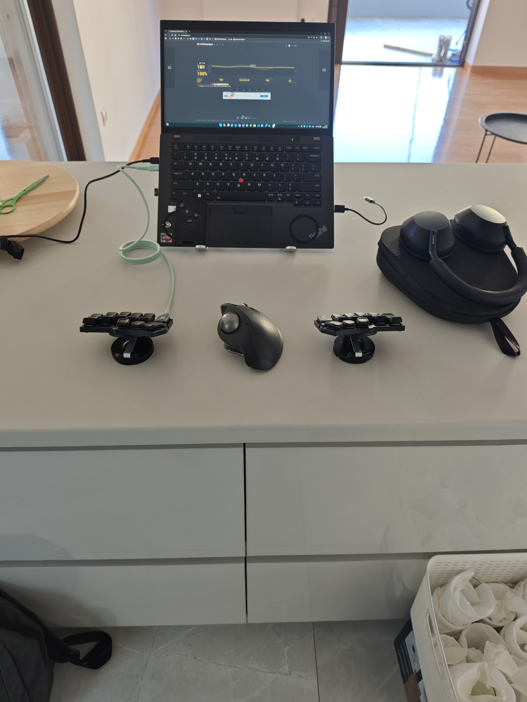

# ⌨️ Temper ZMK: The "Precision Gear" Layout

A high-performance **36-key split layout** for the [Temper keyboard](https://github.com/clyteduo/temper). This configuration merges **Colemak-DH** efficiency with specialized **Greek-bilingual** support and a unique "Manual Gearbox" system for mouse control.

---

## 📑 Table of Contents
1. [Base Layout & Philosophy](#base-layout--philosophy)
2. [Thumb Clusters](#thumb-clusters)
3. [Combos](#combos)
4. [The Mouse Gear System](#the-mouse-gear-system)
5. [Layer Reference](#layer-reference)
6. [Photos](#photos)

---

## Base Layout & Philosophy
The foundation is **Colemak-DH**, modified for high-speed bilingual typing.

* **Greek Optimization:** The bottom-row pinky key is mapped to `;`. In Greek software layouts, this provides the **accent (΄)** for vowels (ά, έ, ί, etc.). The `'` key has been moved to the top-row pinky.
* **No Home-Row Mods (HRM):** This layout avoids HRM to eliminate the latency and accidental activations that occur during high-speed typing or rapid language switching.
* **Sticky Keys:** Instead of holding modifiers, this layout heavily utilizes **Sticky Keys** on the thumbs for one-shot capitalization and modifier combinations.

---

## Thumb Clusters

### On Tap (The "Basics")
| Position | Left Hand | Right Hand |
| :--- | :--- | :--- |
| **Inner** (Tucked) | `Escape` | `Delete` |
| **Neutral** (Home) | `Space` | `Backspace` |
| **Outer** (Wide) | `Shift` (Sticky) | `Enter` |

* **Neutral positions** are assigned to high-frequency keys (`Space`/`Backspace`).
* **Inner positions** house "destructive" or less common keys (`Esc`/`Del`) to prevent accidental presses.

### On Hold (The "Engine")
This layout follows a modified **Miryoku** logic. While Miryoku typically places Numbers on the right and Mouse on the left, **this layout swaps them** to allow for a more natural right-handed "Numpad" feel.

| Position | Left Hand Hold | Right Hand Hold |
| :--- | :--- | :--- |
| **Inner** | **Layer 6:** Bluetooth/Media | **Layer 5:** Function (F1-F12) |
| **Neutral** | **Layer 1:** Navigation | **Layer 4:** Mouse |
| **Outer** | **Layer 2:** Numbers (`sk_mo`) | **Layer 3:** Raise (Symbols) |

> **Note on `sk_mo`:** The Left Outer thumb is a dual-purpose key. **Tap** for Sticky Shift, **Hold** for the Numbers layer.

---

## Combos

### Two-Key Combos (Horizontal)
* `W + F`: **Language Switch** (`Win + Space`)
* `R + S`: **Caps Word** (Contextual - only in Nav)
* `H + ,`: **Minus** (`-`)
* `, + .`: **Control** (Acting as Decimal Point in Num Layer)
* `L + N`: **Tab**
* `X + C`: **Alt**
* `C + D`: **Underscore** (`_`)

### Two-Key Combos (Vertical & Symbols)
* **Braces `{ }`**: `W + R` (Left) / `U + N` (Right)
* **Brackets `[ ]`**: `W + F` (Left) / `N + E` (Right)
* **Parentheses `( )`**: `F + P` (Left) / `L + U` (Right)
* **Misc**: `Q + W` (**\**), `W + F` (**[**), `E + I` (**/**), `W + F` (**|**), `U + Y` (**=**)
* **System**: `Z + O` (**Caps Lock**)

### Layer Toggle Combos (3-Key)
Used for single-handed operation over extended periods:
* `Q + A`: **Toggle Mouse Layer**
* `Y + O`: **Toggle Navigation Layer**
* `V + K`: **Toggle Numbers Layer**

---

## The Mouse Gear System
Using ZMK's `mmv_input_listener`, this layout treats mouse sensitivity like a manual transmission. While in the **Mouse Layer (4)**, hold the following triggers to scale speed:

| Active Layer | Scaling Ratio | Use Case |
| :--- | :--- | :--- |
| **Nav (1)** | **1:3 (33%)** | **Slow:** High-precision UI design or photo editing. |
| **Num (2)** | **1:2 (50%)** | **Mid:** General navigation and spreadsheet work. |
| **Mouse (4)** | **1:1 (100%)** | **Default:** Standard desktop navigation. |
| **Raise (3)** | **3:1 (300%)** | **Fast:** Rapid travel across multi-monitor setups. |

---

## Layer Reference

### 1. Navigation Layer
An inverted-T arrow cluster on the right hand. The left hand provides a "Clipboard Row": **Undo (Ctrl+Z), Cut (Ctrl+X), Copy (Ctrl+C), Paste (Ctrl+V), Redo (Ctrl+Y).**

### 2. Numbers Layer
A 10-key Numpad on the right hand. 
* **Smart Arithmetic:** `+` and `-` keys are **Mod-Morphs**. Tapping produces Plus/Minus; Shifting produces Multiply/Divide.
* **Shortcuts:** Includes `Alt+Tab` and `Alt+Shift+Tab` on the home row for window management.

### 3. Raise (Symbols) Layer
Shifted number row symbols (!@#$%) on the left hand. This layer also triggers the **Fast Mouse** gear.

### 4. Mouse Layer
Left hand provides movement and scrolling in an inverted-T pattern. Bottom row contains browser shortcuts: `Close Tab`, `Focus Address Bar`, `Refresh`, `New Tab`, and `Reopen Tab`.

### 5. Function Layer
F1-F12 keys arranged in a numpad-style grid for easy memorization. Includes `Print Screen`, `Scroll Lock`, and `Task Manager`.

### 6. Bluetooth & Media Layer
Handles 5 Bluetooth profiles, `BT Clear`, and media playback.
* **Bootloader:** Triggered via the top-right key.
* **Mic Toggle:** A system-wide shortcut (`Win+Alt+K`) for meetings.

---

## Photos

  

📂 View Full Gallery

| | |
| :---: | :---: |
|  |  |
|  |  |
|  |  |
|  |  |
|  |  |
|  | |

