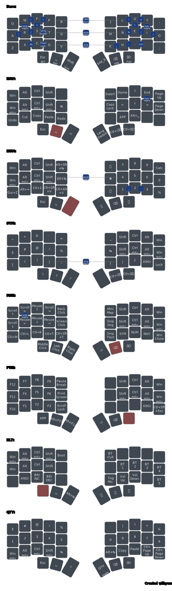
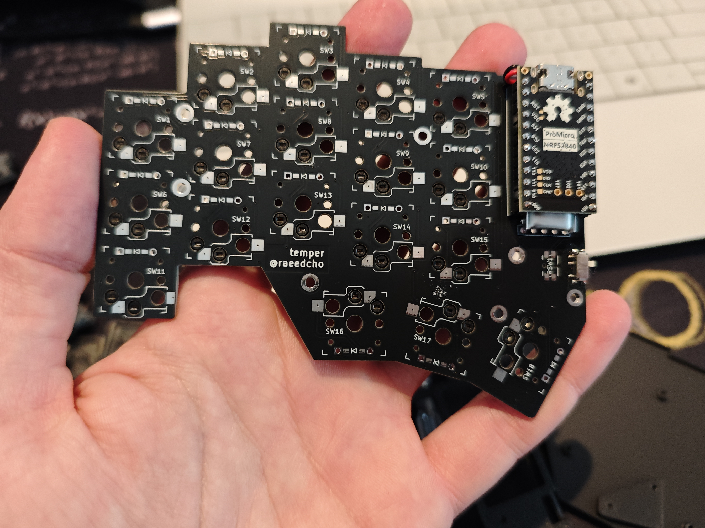
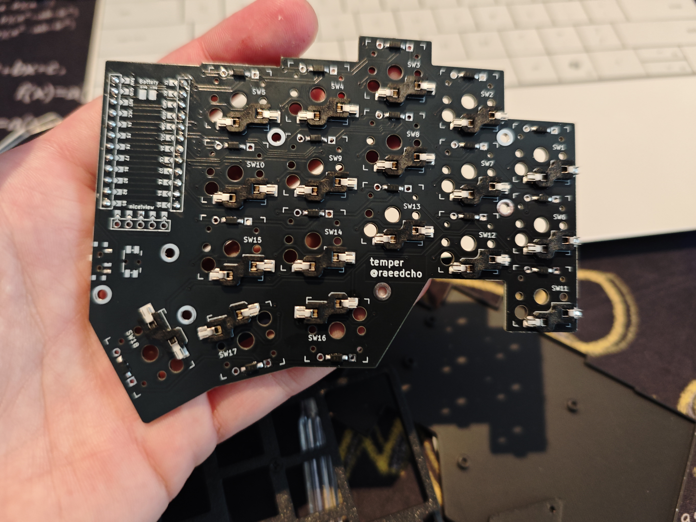
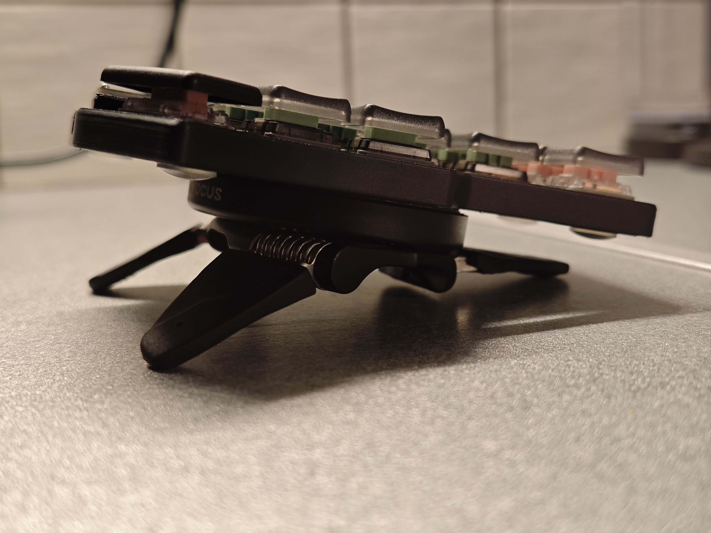
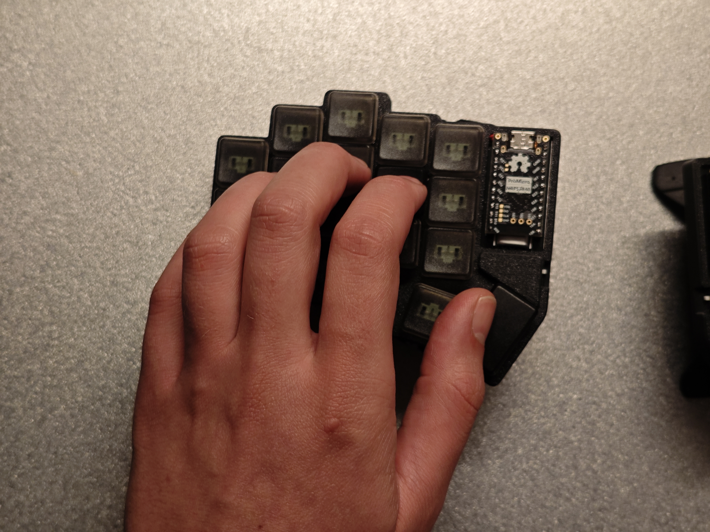
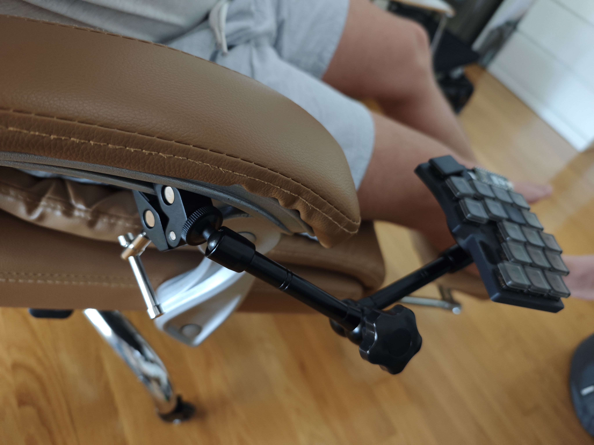

# Keyboard Layout Documentation

## Table of Contents
1. [Base Layout](#base-layout)
2. [Thumb Clusters](#thumb-clusters)
   - [On Tap](#on-tap)
   - [On Hold](#on-hold)
3. [Combos](#combos)
   - [Two-Key Combos](#two-key-combos)
   - [Layer Toggle Combos](#layer-toggle-combos)
4. [Navigation Layer](#navigation-layer)
5. [Numbers Layer](#numbers-layer)
6. [Symbols Layer](#symbols-layer)
7. [Mouse Layer](#mouse-layer)
8. [Function Layer](#function-layer)
9. [Bluetooth Media Layer](#bluetooth-media-layer)
10. [Photos](#photos)

## Base Layout  
The foundation is **Colemak-DH**, with additional modifications on the right hand.  
- Instead of `/` on the bottom-row pinky key, there is `;`, which in Greek is used for accenting letters (e.g., ά, έ, ί, ό, ή, ύ, ώ) and shifted accents like ϊ.  
- Instead of `;` on the top-row pinky key, there is `'`.  
- This layout **does not** include home-row mods, as it is designed for speed, minimizing accidental modifier activations while typing or switching between Greek and English—even within the same sentence.  

## Thumb Clusters  

### On Tap  
**Left:** `Esc`, `Space`, `Shift`  
**Right:** `Enter`, `Backspace`, `Delete`  

- **Neutral thumb positions** (easiest to reach) are assigned to **Space** and **Backspace**, as they are the most frequently used.  
- **Outer thumb positions** (faster but less precise) are used for **Shift** (using sticky key behavior with quick-release) and **Enter** (for quick new-line creation).  
- **Inner thumb positions** (harder to reach) are used for **Escape** and **Delete**, as they are less common and should not be hit accidentally.  
- The layout is strongly influenced by **Miryoku**, with **Shift** implemented as a sticky key with quick-release for one-shot capitalization and modifier combos.

### On Hold  
**Left:** `Bluetooth (Layer 6)`, `Navigation (Layer 1)`, `Numbers (Layer 2)` with special `sk_mo` behavior  
**Right:** `Symbols (Layer 3)`, `Mouse (Layer 4)`, `Function (Layer 5)`  

- Inspired by **Miryoku**, where one thumb activates a layer while the other hand uses that layer's main keys and combos.  
- Standard Miryoku assigns `Media`, `Navigation`, `Mouse` on the left and `Symbols`, `Numbers`, `Function` on the right.  
- However, I swapped **Numbers** and **Mouse** because I found it unnatural to type numbers with my left hand.  
- Since the **Numbers layer** is used frequently, it shouldn't be placed in the inner palm position. Instead, it occupies the **left outer palm key**, with a special `sk_mo` (sticky-key momentary) behavior that allows:
  - **Tap**: Activates sticky shift for capitalizing the next character
  - **Hold**: Activates the Numbers layer
- **Navigation** remains in the **neutral thumb position** for frequent access.  
- The **Mouse trigger** occupies the **right-hand neutral thumb position**, as it mirrors the **inverted-T movement pattern** I use in games with my left hand.

## Combos

### Two-Key Combos

**Horizontal Combos (Adjacent Keys):**
- `W + F` (12-13): **Language Switch** (`Win+Space`) - Quick switch between Greek and English
- `R + S` (12-13 in nav context): **Caps Word** - Auto-capitalizes until space/punctuation
- `H + ,` (26-27): **Minus** (`-`)
- `, + .` (27-28): **Ctrl** - Quick access to Control modifier
- `, + .` (27-28 in Numbers Layer): **Decimal Point** (`.`)
- `L + N` (16-17): **Tab** - Easily accessible Tab key
- `X + C` (21-22): **Alt** - Quick access to Alt modifier
- `C + D` (22-23): **Underscore** (`_`)

**Vertical Combos (Stacked Keys):**
- `W + R` (2-12): **Left Brace** (`{`)
- `U + N` (7-17): **Right Brace** (`}`)

**Symbol Combos - Left Side:**
- `Q + W` (10-11): **Backslash** (`\`)
- `W + F` (11-12): **Left Bracket** (`[`)

**Symbol Combos - Right Side:**
- `L + N` (16-17): **Tab** (also accessible as horizontal combo)
- `N + E` (17-18): **Right Bracket** (`]`)
- `E + I` (18-19): **Slash** (`/`)

**Symbol Combos - Top Row:**
- `F + P` (2-3): **Left Parenthesis** (`(`)
- `L + U` (6-7): **Right Parenthesis** (`)`)
- `W + F` (1-2): **Pipe** (`|`)
- `U + Y` (7-8): **Equal** (`=`)

**Special Combos:**
- `Z + O` (24-31): **Caps Lock** - Toggle caps lock

### Layer Toggle Combos

These **three-key combos** allow persistent layer activation, useful for extended work in a specific mode:

- `Q + A` (10-20): **Toggle Mouse Layer** - Works from Base (0) or Mouse (4) layer
- `Y + O` (19-29): **Toggle Navigation Layer** - Works from Base (0) or Navigation (1) layer
- `V + K` (25-34): **Toggle Numbers Layer** - Works from Base (0) or Numbers (2) layer

These toggles enable **single-handed operation** when you need to stay in a layer for extended periods (e.g., using mouse while holding coffee, or doing lots of numeric entry).

## Navigation Layer

The **Navigation layer** provides efficient text and file navigation without moving hands from home position.

**Left Hand - Modifiers:**
- **Top row:** `Win`, `Alt`, `Ctrl`, `Shift`, None
- **Home row:** `Sticky Win`, `Sticky Alt`, `Sticky Ctrl`, `Sticky Shift`, `Tab`
- **Bottom row:** `Undo (Ctrl+Z)`, `Cut (Ctrl+X)`, `Copy (Ctrl+C)`, `Paste (Ctrl+V)`, `Redo (Ctrl+Y)`

**Right Hand - Navigation:**
- **Top row:** `Insert`, `Home`, `Up`, `End`, `Page Up`
- **Home row:** `Caps Lock`, `Left`, `Down`, `Right`, `Page Down`
- **Bottom row:** None, `Context Menu`, `Spotlight (Alt+Space)`, None, None

**Thumb Cluster:**
- **Left:** `Esc`, `Space`, `Enter`
- **Right:** `Language Switch (Win+Space)`, `Word Delete (Ctrl+Bspc)`, `Word Delete Forward (Ctrl+Del)`

The left hand provides all standard modifiers in both held and sticky variants, while the right hand offers a complete inverted-T arrow cluster plus standard navigation keys. The bottom-left row includes the most common clipboard operations in an easy-to-reach sequence.

## Numbers Layer

The **Numbers layer** is structured like a numpad, prioritizing efficiency in numeric entry.

**Right Hand - Numpad:**
- **Top row:** `=`, `7`, `8`, `9`, `Calculator App`
- **Home row:** `*`, `4`, `5`, `6`, `0`
- **Bottom row:** `/`, `1`, `2`, `3`, `%`

**Left Hand - Modifiers & Shortcuts:**
- **Top row:** `Win`, `Alt`, `Ctrl`, `Shift`, `Alt+Shift+Tab` (reverse window switch)
- **Home row:** `Sticky Win`, `Sticky Alt`, `Sticky Ctrl`, `Sticky Shift`, `Alt+Tab` (window switch)
- **Bottom row:** `Win+Z`, `Alt+=`, `Ctrl+1`, `Ctrl+Shift+V`, `Ctrl+Alt+V`

**Thumb Cluster:**
- **Left:** `Esc`, `Space`, None
- **Right:** `+`, `-`, `Backspace`

The numpad layout follows standard positioning with zero on the home row pinky. Arithmetic operators are arranged in a column for quick calculations. The decimal point is accessible via the `, + .` combo (27-28) within this layer.

### Precision Control in Numbers Layer

When in the Numbers layer, the mouse pointer operates at **50% speed** (medium precision), allowing for accurate cursor positioning during data entry or spreadsheet work without needing to switch to the dedicated Mouse layer.

## Symbols Layer

The **Symbols layer** includes frequently used programming and punctuation symbols.

**Left Hand - Symbols:**
- **Top row:** `` ` ``, `&`, `*`, `^`, `=`
- **Home row:** `!`, `@`, `#`, `$`, `%`
- **Bottom row:** `[`, `(`, `)`, `]`, `-`

**Right Hand - Modifiers:**
- **Top row:** `_`, `Shift`, `Ctrl`, `Alt`, `Win`
- **Home row:** `Tab`, `Sticky Shift`, `Sticky Ctrl`, `Sticky Alt`, `Sticky Win`
- **Bottom row:** `{`, `|`, `}`, `Alt Gr`, `Win+L` (lock screen)

**Thumb Cluster:**
- **Left:** `\`, `?`, `/`
- **Right:** None, `Word Delete (Ctrl+Bspc)`, `Word Delete Forward (Ctrl+Del)`

The layout follows logical grouping with common programming symbols on the left and modifiers mirrored on the right. Brackets and parentheses are positioned symmetrically for intuitive access.

### Fast Mouse Movement in Symbols Layer

When in the Symbols layer, the mouse pointer operates at **300% speed** (fast movement), enabling quick cursor repositioning across the screen while accessing symbols.

## Mouse Layer

The **Mouse layer** provides complete mouse control without leaving the keyboard.

**Left Hand - Mouse Control:**
- **Top row:** `Scroll Up`, `Scroll Left`, `Move Up`, `Scroll Right`, `Mouse Button 4`
- **Home row:** `Scroll Down`, `Move Left`, `Move Down`, `Move Right`, `Mouse Button 5`
- **Bottom row:** `Close Tab (Ctrl+W)`, `Focus Address Bar (Ctrl+L)`, `Refresh (Ctrl+R)`, `New Tab (Ctrl+T)`, `Reopen Tab (Ctrl+Shift+T)`

**Right Hand - Modifiers & Shortcuts:**
- **Top row:** `Win+Shift+D`, `Shift`, `Ctrl`, `Alt`, `Win`
- **Home row:** `Win+Shift+S` (screenshot), `Sticky Shift`, `Sticky Ctrl`, `Sticky Alt`, `Sticky Win`
- **Bottom row:** `Win+Shift+T`, `Symbols Layer (mo)`, `Numbers Layer (mo)`, `Navigation Layer (mo)`, `Close Window (Alt+F4)`

**Thumb Cluster:**
- **Left:** `Middle Click`, `Left Click`, `Right Click`
- **Right:** `Enter`, `Backspace`, `Delete`

The inverted-T movement pattern on the left hand mirrors gaming muscle memory. Browser efficiency shortcuts are positioned for single-handed operation. The right hand provides access to other layers via momentary activation, enabling combined functionality (e.g., precise mouse movement at Navigation layer speed while staying in Mouse layer).

### Multi-Speed Mouse Control

The mouse system provides **three precision levels** through automatic speed adjustment based on active layer:

- **Navigation Layer active (1)**: **33% speed** - Ultra-precise for detailed work, pixel-perfect positioning
- **Numbers Layer active (2)**: **50% speed** - Moderate precision for general navigation and data entry
- **Mouse Layer (4)**: **100% speed** - Full speed (default) for quick movements across screen

**How it works:** The speed automatically adjusts when you momentarily activate another layer while in Mouse layer. For example, holding the Navigation layer trigger with your left thumb while moving the mouse with your left hand provides ultra-precise control. This uses ZMK's `mmv_input_listener` with layer-specific input processors.

## Function Layer

The **Function layer** provides F-keys and system controls.

**Left Hand - Function Keys:**
- **Top row:** `F12`, `F7`, `F8`, `F9`, `Pause Break`
- **Home row:** `F11`, `F4`, `F5`, `F6`, `Print Screen`
- **Bottom row:** `F10`, `F1`, `F2`, `F3`, `Scroll Lock`

**Right Hand - Modifiers:**
- **Top row:** None, `Shift`, `Ctrl`, `Alt`, `Win`
- **Home row:** None, `Sticky Shift`, `Sticky Ctrl`, `Sticky Alt`, `Sticky Win`
- **Bottom row:** None, None, None, `Alt Gr`, `Task Manager (Ctrl+Shift+Esc)`

**Thumb Cluster:**
- **Left:** `Context Menu`, `Alt+F11`, `Alt+F12`
- **Right:** `Enter`, `Backspace`, None

Function keys are arranged in a logical numpad-style layout with F1-F3 on bottom, F4-F6 on home, F7-F9 on top, and F10-F12 in the leftmost column. System keys like Print Screen and Scroll Lock are positioned on the right side of the left hand.

## Bluetooth Media Layer

The **Bluetooth & Media layer** handles device switching, media controls, and system utilities.

**Left Hand - Modifiers & Boot:**
- **Top row:** `Sticky Win`, `Sticky Alt`, `Sticky Ctrl`, `Sticky Shift`, `Bootloader`
- **Home row:** `Win`, `Alt`, `Ctrl`, `Shift`, None
- **Bottom row:** None, `Alt Gr`, `Brightness Up`, `Brightness Down`, None

**Right Hand - Bluetooth & Media:**
- **Top row:** `BT Clear`, None, None, None, None
- **Home row:** None, `BT Device 0`, `BT Device 1`, `BT Device 2`, `BT Device 3`
- **Bottom row:** `Win+Alt+K` (mic toggle), `Volume Up`, `Volume Down`, None, `BT Device 4`

**Thumb Cluster:**
- **Left:** None, `Space`, `Alt+Tab`
- **Right:** `Play/Pause`, `Previous Track`, `Next Track`

**Bootloader Access:** To enter bootloader mode for firmware flashing, activate this layer and press the top-right key. Both the layer trigger and boot button must be on the same keyboard split.

**Bluetooth Profiles:** Five device profiles (0-4) allow quick switching between paired devices. Use BT Clear to remove the current profile's pairing.

**Media Controls:** Standard playback controls on the right thumb cluster, plus system-wide microphone toggle (`Win+Alt+K`) that works across all apps regardless of focus.

## Photos

